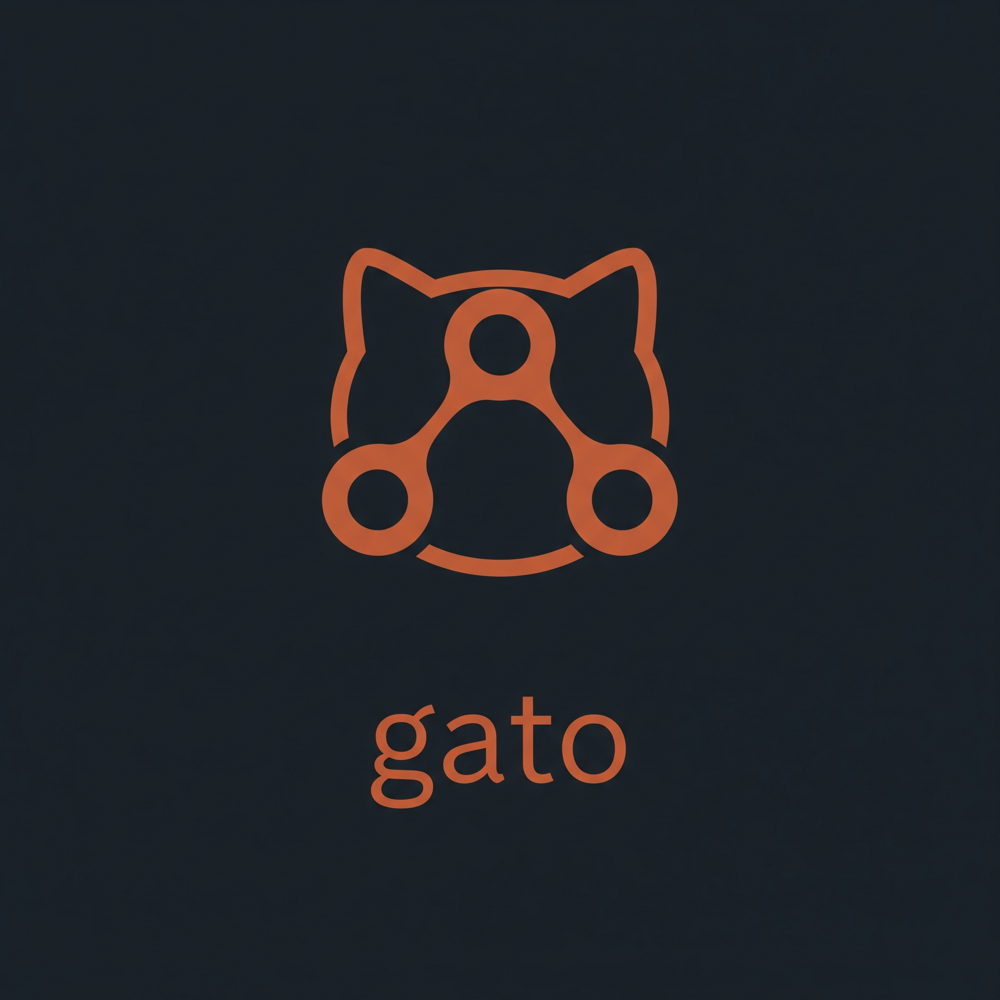

# Gato
**A High-Performance, Parallel-First Version Control System**

> *"Traditional VCS implementations were designed in a single-core era. Gato is an experimental engine built in Rust to challenge the status quo by leveraging massive parallelism and modern compression."*

### 🛠️ Quick Start

**Gato** commands mirror Git but include short aliases for speed.

| Command | Alias | Description |
| --- | --- | --- |
| `gato init` | `i` | Initialize a repository |
| `gato add <paths>` | `a` | Add files (e.g., `gato a .`) |
| `gato commit <msg> <author>` | `c` | Commit changes |
| `gato new-branch <name>` | `nb` | Create a new branch |
| `gato change-branch <name>` | `cb` | Switch to a branch |
| `gato checkout <index>` | `co` | Checkout a commit (0 = latest) |

> *Note: `status` and `log` commands are currently under development.*

---

## ⚡ Performance Benchmarks

Gato was benchmarked against Git on a **multimedia-heavy repository** (containing audio/binary files), which represents modern workloads like **AI Training Datasets** and **Game Assets**.

The results demonstrate Gato's superior handling of large binaries through aggressive parallelization (Rayon) and modern compression algorithms (Zstd).

### 1. Speed (Throughput)
*Environment: Linux, 8-Core CPU, Zstd Level 1 compression.*

| Operation | Scenario | Git (Serial) | Gato (Parallel) | Speedup |
| :--- | :--- | :--- | :--- | :--- |
| **Initial Add** | **Cold Cache** | 123.00s | **25.00s** | **~5x Faster** |
| **Re-Add** | **Warm Cache** | 70.45s | **1.91s** | **~35x Faster** |

> **Note:** Git struggles with large binary files, performing serial hashing which bottlenecks the CPU. Gato saturates all available cores to process blobs concurrently.

### 2. Storage Efficiency (Compression)
Gato replaces `zlib` (used by Git) with `zstd`, resulting in significantly smaller repository sizes for binary assets.

| Repository | Size on Disk | Efficiency |
| :--- | :--- | :--- |
| **.git** | 3.9 GB | Baseline |
| **.gato** | **1.9 GB** | **50% Smaller** |

*(As seen in the `du -sh` comparison below)*

---

## 🎯 Use Cases

While Git is the standard for text-based source code, Gato's architecture makes it uniquely suitable for:

* **Game Development:** managing gigabytes of textures, audio, and models without the complexity of Git LFS.
* **Machine Learning:** Efficiently versioning large training datasets and model weights.
* **Multimedia Archives:** Fast deduplication and storage of binary heavy directories.

---

## 🏗️ Technical Architecture

Gato is not just a clone; it is a re-imagining of internal plumbing:

* **Parallel I/O:** Utilizes `rayon` to parallelize object hashing, compression, and file writing.
* **Hybrid I/O Strategy:** Implements smart memory mapping (`mmap`) for large blobs while using buffered reads for small files to minimize syscall overhead.
* **Modern Cryptography:** Uses **BLAKE3** for hashing (much faster than Git's SHA-1) while maintaining cryptographic security.
* **Compression:** Uses **Zstd** (Zstandard) which offers superior compression ratios and decompression speeds compared to Deflate.

## ⚠️ Disclaimer
This is an **educational research project** built to understand the internals of version control systems. While it outperforms Git in specific raw-throughput scenarios, it is not feature-complete (lacks networking, merging strategies, etc.) and is not intended for production use yet.

---

**Built with 🦀 and curiosity.**
